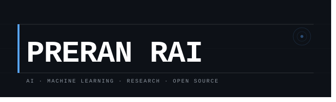

<!-- ========================================== -->
<!-- HERO SECTION - VISUAL INTRO & BANNER       -->
<!-- ========================================== -->
<p align="center">
  
</p>

<p align="center">
  <!-- DenverCoder1's Typing SVG animation -->
  <a href="https://git.io/typing-svg">
    
  </a>
</p>

<p align="center">
  <!-- Visitor Counter and Badges -->
  
  
  
</p>

<p align="center">
  <!-- Premium Portfolio Button -->
  <a href="https://preran-rai.vercel.app/"></a>
  <a href="https://www.linkedin.com/in/preran-rai-92414b293/"></a>
  <a href="https://github.com/PreranRai"></a>
  <a href="mailto:preranrai3@gmail.com"></a>
</p>

<br />

<!-- ========================================== -->
<!-- ABOUT ME SECTION                           -->
<!-- ========================================== -->
## 🪐 About Me

```yaml
student:
  name: Preran Rai
  academics: Final Year Computer Science Engineering
  specialization: Artificial Intelligence & Machine Learning
  institution: Sahyadri College of Engineering & Management, Mangaluru
  interests: [Artificial Intelligence, Machine Learning, Deep Learning, Computer Vision, Large Language Models, Agentic AI, AI Automation, Full Stack Development, Research]
  philosophy: "Leveraging state-of-the-art AI to preserve history & optimize the future."
```

👋 **Hello and Welcome!** I am a Final Year Computer Science Engineering student specializing in Artificial Intelligence & Machine Learning at Sahyadri College of Engineering & Management. As a Full Stack Developer, Research Enthusiast, and Open Source Contributor, I am deeply passionate about engineering intelligent systems to solve real-world problems.

- 🧠 Core Focus: **Deep Learning pipelines, Computer Vision architectures, and Full Stack application development.**
- 💡 Core Belief: **Bridging the gap between complex machine learning algorithms and elegant, automated user experiences.**

<br />

<!-- ========================================== -->
<!-- PORTFOLIO SECTION                          -->
<!-- ========================================== -->
## 🌐 Portfolio

My portfolio showcases my complete journey as an AI & ML Engineer. It includes:

• AI Projects  
• Research Work  
• Live Applications  
• Technical Skills  
• Resume  
• Certifications  
• Achievements  
• Contact Information  

<p align="center">
  <a href="https://preran-rai.vercel.app/"></a>
</p>

This section is designed to encourage visitors to explore my portfolio instead of duplicating its content here.

<br />

<!-- ========================================== -->
<!-- CURRENT FOCUS SECTION                      -->
<!-- ========================================== -->
## 🚀 Current Focus

```yaml
Current Focus:
  • Artificial Intelligence & Machine Learning
  • Deep Learning
  • Computer Vision
  • Large Language Models (LLMs)
  • Agentic AI
  • AI Automation
  • Full Stack Development
  • Research
  • Open Source
```

<br />

<!-- ========================================== -->
<!-- TECH STACK SECTION                         -->
<!-- ========================================== -->
## 🛠️ Technology Stack

<table width="100%">
  <tr>
    <!-- COLUMN 1: AI/ML & LANGUAGES -->
    <td width="50%" valign="top">
      <h4>🧠 Artificial Intelligence &amp; ML</h4>
      <a href="https://pytorch.org"></a>
      <a href="https://tensorflow.org"></a>
      <a href="https://scikit-learn.org"></a>
      <a href="https://opencv.org"></a>
      <a href="https://numpy.org"></a>
      <a href="https://pandas.pydata.org"></a>
      <br /><br />
      <h4>💻 Languages</h4>
      <a href="https://python.org"></a>
      <a href="https://isocpp.org"></a>
      <a href="https://en.wikipedia.org/wiki/C_(programming_language)"></a>
      <a href="https://developer.mozilla.org/en-US/docs/Web/JavaScript"></a>
      <a href="https://en.wikipedia.org/wiki/SQL"></a>
    </td>
    <!-- COLUMN 2: FULL STACK & DEV TOOLS -->
    <td width="50%" valign="top">
      <h4>🌐 Frontend &amp; Backend</h4>
      <a href="https://react.dev"></a>
      <a href="https://nodejs.org"></a>
      <a href="https://expressjs.com"></a>
      <a href="https://tailwindcss.com"></a>
      <a href="https://w3schools.com/html/"></a>
      <a href="https://w3schools.com/css/"></a>
      <br /><br />
      <h4>💾 Databases, Cloud &amp; Tools</h4>
      <a href="https://mysql.com"></a>
      <a href="https://mongodb.com"></a>
      <a href="https://postgresql.org"></a>
      <a href="https://git-scm.com"></a>
      <a href="https://github.com"></a>
      <a href="https://postman.com"></a>
    </td>
  </tr>
</table>

<br />

<!-- ========================================== -->
<!-- FEATURED WORK SECTION                      -->
<!-- ========================================== -->
## 💼 Featured Work

I've built multiple AI, Machine Learning, Deep Learning, and Full Stack applications. Here are some of my major projects:

• **Intelligent Book Learning Platform** 📚  
• **AgriSeva** 🌾  
• **Barepuna** 📜  
• **Tulu-Kalpuga** 🗣️  
• **DBMS Mini Project** 💾  

Explore detailed case studies, architecture diagrams, source code, documentation, technical write-ups, and live applications directly on my portfolio:

🔗 [preran-rai.vercel.app](https://preran-rai.vercel.app/)

<br />

<!-- ========================================== -->
<!-- RESEARCH & ONGOING PROJECTS                -->
<!-- ========================================== -->
## 🔬 Research Focus & Ongoing Work

*   **Ancient Script Digitization (OCR)**
    *   Developing novel lightweight CNN/Vision Transformer topologies optimized for character segmentation and classification of historical low-resource scripts (specifically Tulu Lipi).
*   **Computer Vision in Agro-Tech**
    *   Evaluating CNN robustness under complex outdoor conditions for plant disease detection and estimating foliage metrics in precision farming.
*   **Generative AI & LLM Agents**
    *   Exploring local LLM fine-tuning strategies for regional languages and building autonomous retrieval-augmented generation (RAG) agents.

<br />

<!-- ========================================== -->
<!-- ACHIEVEMENTS & CERTIFICATIONS              -->
<!-- ========================================== -->
## 🏆 Achievements & Key Credentials

• **Internship Excellence:** Proud alumnus of the **HackHarbor 3.0** Internship program, building production-grade web solutions and collaborative tools.  
• **NPTEL Certification:** Completed rigorous academic evaluations in core Artificial Intelligence & Machine Learning subjects with excellent marks.  
• **Infosys Springboard:** Successfully completed comprehensive learning paths in Full Stack Development, Data Science, and Python.  
• **Hackathon Contender:** Regularly participating in local & national hackathons, driving innovation from ideation to functioning prototypes.  

<br />

<!-- ========================================== -->
<!-- GITHUB STATS & ANALYTICS                   -->
<!-- ========================================== -->
## 📊 GitHub Analytics

<div align="center">


</div>

---

<div align="center">

<i>// Building AI-powered solutions, one commit at a time 🚀</i>

</div>

<br />

<!-- ========================================== -->
<!-- CONNECT WITH ME                            -->
<!-- ========================================== -->
## 🤝 Connect With Me

<p align="center">
  <a href="https://preran-rai.vercel.app/"></a>
  <a href="https://www.linkedin.com/in/preran-rai-92414b293/"></a>
  <a href="https://github.com/PreranRai"></a>
  <a href="mailto:preranrai3@gmail.com"></a>
</p>

<br />

<!-- ========================================== -->
<!-- FOOTER                                     -->
<!-- ========================================== -->
<hr />

<div align="center">

⭐ Thanks for visiting my GitHub profile!

I'm always open to collaborating on:

• Artificial Intelligence  
• Machine Learning  
• Full Stack Development  
• Research  
• Open Source  

Let's build impactful technology together.

</div>
